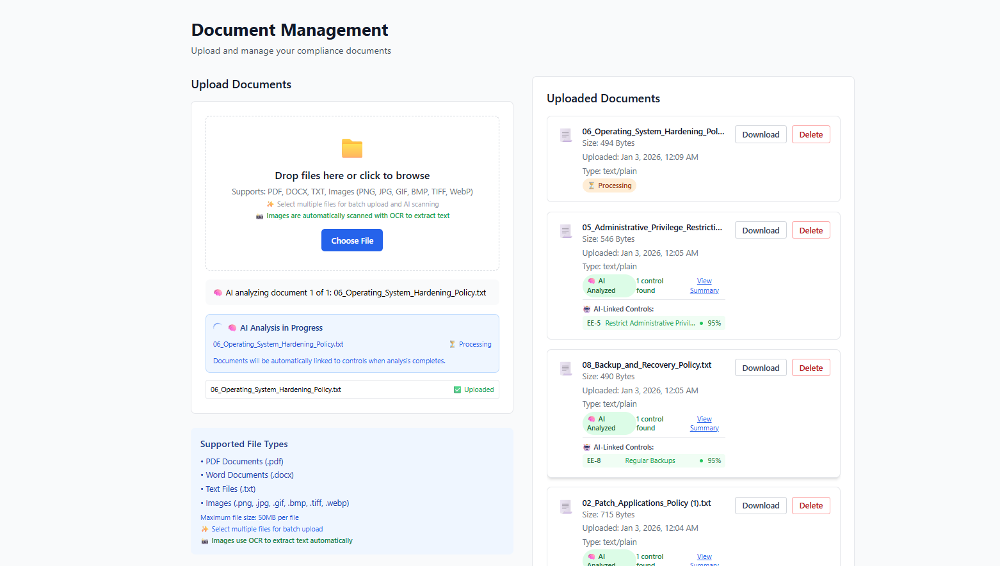

# 🦆 GeekyGoose Compliance

> **Get Compliant Fast** - Enterprise-Grade AI-Powered Compliance Automation Platform

[](https://github.com/ggcompli/GeekyGoose-Compliance/blob/main/LICENSE)
[](https://github.com/ggcompli/GeekyGoose-Compliance/releases)
[](https://github.com/ggcompli/GeekyGoose-Compliance)

---

## What is GeekyGoose Compliance?

GeekyGoose Compliance is an **open-source, AI-powered compliance automation platform** that helps organizations achieve and maintain compliance with industry frameworks like Essential Eight, ISO 27001, NIST CSF, and more.

### Key Features

🤖 **AI-Powered Analysis**
- Automated document scanning and evidence analysis
- Smart gap detection and remediation recommendations
- Multi-model support (Ollama local + OpenAI cloud)

📊 **Comprehensive Reporting**
- Executive dashboards with visual metrics
- Detailed gap analysis and action plans
- Export capabilities for audits

🔧 **Framework Support**
- Essential Eight (complete implementation)
- Extensible for ISO 27001, NIST CSF, CIS Controls
- Multi-tenant organization support

📋 **Template System**
- Reusable compliance templates
- Policy generation and validation
- Evidence requirement tracking

---

## Quick Start

### Option 1: Docker (Recommended)

```bash
# Clone the repository
git clone https://github.com/ggcompli/GeekyGoose-Compliance.git
cd GeekyGoose-Compliance

# Copy environment file and configure
cp .env.example .env
# Edit .env with your settings

# Start all services
docker-compose up -d

# Initialize database
docker-compose exec api python init_db.py
docker-compose exec api python run_seed.py

# Access the application
open http://localhost:3000
```

### Option 2: Manual Installation

See the [Installation Guide](https://github.com/ggcompli/GeekyGoose-Compliance#-quick-start) for detailed instructions.

---

## Licensing

GeekyGoose Compliance uses a **dual-licensing model** to serve both community and commercial users:

### 🆓 Community Edition (AGPLv3)

**Perfect for:**
- Self-hosted deployments
- Internal company use
- Open-source projects
- Learning and evaluation

**License:** [AGPLv3](license)

[Learn More About Community Edition →](license#community-edition-agplv3)

### 💼 Commercial License

**Perfect for:**
- Hosted/SaaS services
- Proprietary integrations
- White-label deployments
- No source code disclosure

**Contact:** [licensing@geekygoose.io](mailto:licensing@geekygoose.io)

[Learn More About Commercial Licensing →](commercial)

---

## Quick Links

<div class="quick-links">
  <div class="link-card">
    <h3>📖 Documentation</h3>
    <p>Get started with installation, configuration, and usage guides.</p>
    <a href="https://github.com/ggcompli/GeekyGoose-Compliance#readme">Read Docs →</a>
  </div>

  <div class="link-card">
    <h3>📄 License Information</h3>
    <p>Understand our dual-license model and choose the right option.</p>
    <a href="license">View License →</a>
  </div>

  <div class="link-card">
    <h3>💼 Commercial Licensing</h3>
    <p>Enterprise and hosted service licensing options.</p>
    <a href="commercial">Get Commercial License →</a>
  </div>

  <div class="link-card">
    <h3>🏷️ Trademark Policy</h3>
    <p>Learn about using the GeekyGoose name and logo.</p>
    <a href="trademark">Trademark Policy →</a>
  </div>

  <div class="link-card">
    <h3>🤝 Contributing</h3>
    <p>Join our community and contribute to the project.</p>
    <a href="contributing">Contribute →</a>
  </div>

  <div class="link-card">
    <h3>🐛 Report Issues</h3>
    <p>Found a bug or have a feature request?</p>
    <a href="https://github.com/ggcompli/GeekyGoose-Compliance/issues">Report Issue →</a>
  </div>
</div>

---

## Why Choose GeekyGoose?

### For Organizations

✅ **Save Time**: Automate 80% of compliance documentation work
✅ **Reduce Costs**: Open-source alternative to expensive compliance tools
✅ **Stay Compliant**: Continuous monitoring and gap analysis
✅ **Audit Ready**: Generate comprehensive reports in minutes

### For Developers

✅ **Open Source**: Full access to source code under AGPLv3
✅ **Extensible**: Add your own frameworks and integrations
✅ **Modern Stack**: Next.js, FastAPI, PostgreSQL, Docker
✅ **AI-Powered**: Leverage local LLMs or cloud AI

### For Compliance Teams

✅ **Framework Agnostic**: Support for multiple compliance frameworks
✅ **Evidence Management**: Centralized document and evidence tracking
✅ **Collaboration**: Multi-tenant with role-based access
✅ **Automation**: AI-driven compliance scanning and validation

---

## Screenshots

### Dashboard Overview

*Comprehensive compliance dashboard with real-time metrics*

### AI Document Analysis

*AI analyzes documents and maps them to framework controls*

### Compliance Reporting

*Generate detailed compliance reports with gap analysis*

---

## Community & Support

### Community Edition Support
- 📖 [Documentation](https://github.com/ggcompli/GeekyGoose-Compliance#readme)
- 💬 [GitHub Discussions](https://github.com/ggcompli/GeekyGoose-Compliance/discussions)
- 🐛 [Issue Tracker](https://github.com/ggcompli/GeekyGoose-Compliance/issues)
- 📧 [Community Forum](mailto:community@geekygoose.io)

### Commercial Support
- ⚡ Priority Support with SLA
- 📞 Direct phone and email support
- 🛠️ Custom development and integrations
- 📚 Training and onboarding
- 📧 [sales@geekygoose.io](mailto:sales@geekygoose.io)

---

## Roadmap

### Current (v0.3.0)
- ✅ Essential Eight framework support
- ✅ AI-powered document analysis
- ✅ Template and policy generation
- ✅ Multi-tenant architecture

### Coming Soon (v0.4.0)
- 🔜 ISO 27001 framework
- 🔜 NIST CSF support
- 🔜 Enhanced reporting
- 🔜 API integrations

### Future
- 📅 SOC 2 compliance
- 📅 PCI DSS framework
- 📅 Mobile application
- 📅 Third-party integrations

[View Full Roadmap →](https://github.com/ggcompli/GeekyGoose-Compliance/projects)

---

## Get Started Today

<div class="cta-buttons">
  <a href="https://github.com/ggcompli/GeekyGoose-Compliance" class="btn btn-primary">
    View on GitHub →
  </a>
  <a href="license" class="btn btn-secondary">
    Review License
  </a>
  <a href="commercial" class="btn btn-secondary">
    Commercial Licensing
  </a>
</div>

---

<p class="footer-text">
Made with ❤️ for the compliance community<br>
<strong>Get Compliant Fast with GeekyGoose! 🦆</strong>
</p>

<style>
.quick-links {
  display: grid;
  grid-template-columns: repeat(auto-fit, minmax(300px, 1fr));
  gap: 20px;
  margin: 30px 0;
}

.link-card {
  border: 1px solid #e1e4e8;
  border-radius: 6px;
  padding: 20px;
  background: #f6f8fa;
  transition: transform 0.2s, box-shadow 0.2s;
}

.link-card:hover {
  transform: translateY(-2px);
  box-shadow: 0 4px 12px rgba(0,0,0,0.1);
}

.link-card h3 {
  margin-top: 0;
  color: #0366d6;
}

.link-card a {
  color: #0366d6;
  text-decoration: none;
  font-weight: 600;
}

.cta-buttons {
  display: flex;
  gap: 15px;
  margin: 30px 0;
  flex-wrap: wrap;
}

.btn {
  display: inline-block;
  padding: 12px 24px;
  border-radius: 6px;
  text-decoration: none;
  font-weight: 600;
  transition: all 0.2s;
}

.btn-primary {
  background: #2ea44f;
  color: white;
}

.btn-primary:hover {
  background: #2c974b;
}

.btn-secondary {
  background: #f6f8fa;
  color: #24292e;
  border: 1px solid #e1e4e8;
}

.btn-secondary:hover {
  background: #e1e4e8;
}

.footer-text {
  text-align: center;
  color: #586069;
  margin-top: 50px;
  padding-top: 30px;
  border-top: 1px solid #e1e4e8;
}
</style>
